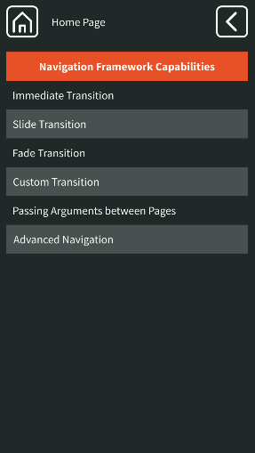

# Overview

This application demonstrates the Navigation Framework add-on library.
It shows how to declare the pages of an application, navigate between them, animate the page changes with transitions, and pass an argument from one page to the next.

The application's home page displays a list of accessible pages, each one demonstrating one of the Navigation Framework's capabilities.

Here are the items of the home page:

- `Immediate Transition`: navigates to a page without animation.
- `Slide Transition`: navigates to a page with the `SlideTransition` of the library.
- `Fade Transition`: navigates to a page with the `FadeTransition` of the library.
- `Custom Transition`: navigates to a page with a transition written for this example, which splits the current content apart to reveal the next page.
- `Passing Arguments between Pages`: carries the check boxes and radio button selection to the next page as the argument of the navigation.
- `Advanced Navigation`: chains four pages and displays the navigation history, using `navigateTo`, `replaceWith`, `navigateBack` and `navigateBackTo`.

The source is organized as follows:

- `navigation`: the key of each page and the factory that builds a page from its key.
- `pages`: the pages, one package per feature.
- `widget`: the widgets used by the pages, all based on vector fonts and vector images.

# Requirements

- MICROEJ SDK 6.
- A VEE Port that contains:

    - EDC-1.3 or higher.
    - BON-1.4 or higher.
    - MICROUI-3.6 or higher.
    - MICROVG-1.5 or higher.
    - DRAWING-1.0 or higher.

This example has been tested on:

- NXP i.MX RT1170 VEE Port 3.1.0.

# Usage

By default, the example uses the NXP i.MX RT1170 VEE Port.

Refer to the [Select a VEE Port](https://docs.microej.com/en/latest/SDK6UserGuide/selectVeePort.html) documentation for more information.

## Run on Simulator

In IntelliJ IDEA or Android Studio:

- Open the Gradle tool window by clicking on the elephant icon on the right side,
- Expand the `Tasks` list,
- From the `Tasks` list, expand the `microej` list,
- Double-click on `runOnSimulator`,
- The application starts, the traces are visible in the Run view.

Alternative ways to run in simulation are described in the [Run on Simulator](https://docs.microej.com/en/latest/SDK6UserGuide/runOnSimulator.html) documentation.

## Run on Device

Make sure to properly setup the VEE Port environment before going further.
Refer to the VEE Port README for more information.

In IntelliJ IDEA or Android Studio:

- Open the Gradle tool window by clicking on the elephant icon on the right side,
- Expand the `Tasks` list,
- From the `Tasks` list, expand the `microej` list,
- Double-click on `runOnDevice`,
- The device is flashed. Use the appropriate tool to retrieve the execution traces.

Alternative ways to run on device are described in the [Run on Device](https://docs.microej.com/en/latest/SDK6UserGuide/runOnDevice.html) documentation.

# Dependencies

_All dependencies are retrieved transitively by Gradle_.

# Source

N/A.

# Restrictions

None.

_Copyright 2026 MicroEJ Corp. All rights reserved._  
_Use of this source code is governed by a BSD-style license that can be found with this software_  
_Build: 7E4D1F7C_
