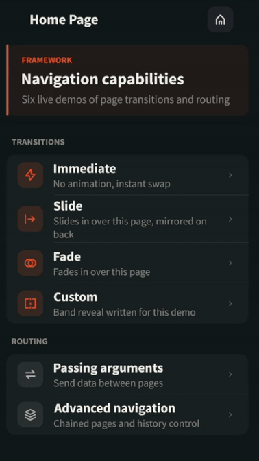

# Overview

This application demonstrates the Navigation Framework add-on library.
It shows how to declare the pages of an application, navigate between them, animate the page changes with transitions, and pass an argument from one page to the next.

The application's home page displays a list of accessible pages, each one demonstrating one of the Navigation Framework's capabilities.

Here are the items of the home page:

- `Immediate`: navigates to a page without animation, with `Transition.IMMEDIATE`.
- `Slide`: navigates to a page with the `SlideTransition` of the library. The next page slides over the current one, which does not move. The direction is mirrored on the way back.
- `Fade`: navigates to a page with the `FadeTransition` of the library. The next page fades in over the current one.
- `Custom`: navigates to a page with a transition written for this example. It reveals the next page through a band that widens from the center of the content area, and through two bands that grow from the edges on the way back.
- `Passing arguments`: carries the check boxes and radio button selection to the next page as the argument of the navigation. The result page slides up from the bottom edge, and slides back down when it is left.
- `Advanced navigation`: chains four pages and displays the navigation history, using `navigateTo`, `replaceWith`, `navigateBack` and `navigateBackTo`.

Every page animates its back control and its home control with the transition that brought the page in.

The source is organized as follows:

- `navigation`: the key of each page and the factory that builds a page from its key.
- `pages`: the pages, one package per feature.
- `widget`: the widgets used by the pages, all based on vector fonts and vector images.

# Requirements

- MICROEJ SDK 6.
- A VEE Port that contains:

    - EDC-1.3 or higher.
    - BON-1.4 or higher.
    - MICROUI-3.6 or higher.
    - MICROVG-1.5 or higher.
    - DRAWING-1.0 or higher.

- An images heap large enough for one image the size of the page content area.
  That image is the buffer the animated transitions draw the incoming page from.
  The `ej.microui.memory.imagesheap.size` property of `configuration/common.properties` is sized for it.
  Set the `ej.navigation.transition.snapshots` constant to `false` to remove that buffer.
  The fade and the custom band reveal then become instant page changes.
- A Java thread stack of at least 8 blocks of 512 bytes.
  MWT renders a widget tree with four stack frames per nesting level, and the default of 4 blocks overflows on the pages of this example.
  The `core.memory.thread.max.size` property of `configuration/common.properties` is set for it.

This example has been tested on:

- NXP i.MX RT1170 VEE Port 3.1.0.

# Usage

By default, the example uses the NXP i.MX RT1170 VEE Port.

Refer to the [Select a VEE Port](https://docs.microej.com/en/latest/SDK6UserGuide/selectVeePort.html) documentation for more information.

## Run on Simulator

In IntelliJ IDEA or Android Studio:

- Open the Gradle tool window by clicking on the elephant icon on the right side,
- Expand the `Tasks` list,
- From the `Tasks` list, expand the `microej` list,
- Double-click on `runOnSimulator`,
- The application starts, the traces are visible in the Run view.

Alternative ways to run in simulation are described in the [Run on Simulator](https://docs.microej.com/en/latest/SDK6UserGuide/runOnSimulator.html) documentation.

## Run on Device

Make sure to properly setup the VEE Port environment before going further.
Refer to the VEE Port README for more information.

In IntelliJ IDEA or Android Studio:

- Open the Gradle tool window by clicking on the elephant icon on the right side,
- Expand the `Tasks` list,
- From the `Tasks` list, expand the `microej` list,
- Double-click on `runOnDevice`,
- The device is flashed. Use the appropriate tool to retrieve the execution traces.

Alternative ways to run on device are described in the [Run on Device](https://docs.microej.com/en/latest/SDK6UserGuide/runOnDevice.html) documentation.

# Dependencies

_All dependencies are retrieved transitively by Gradle_.

# Source

N/A.

# Restrictions

None.

_Copyright 2026 MicroEJ Corp. All rights reserved._  
_Use of this source code is governed by a BSD-style license that can be found with this software_  
_Build: 7E4D1F7C_
